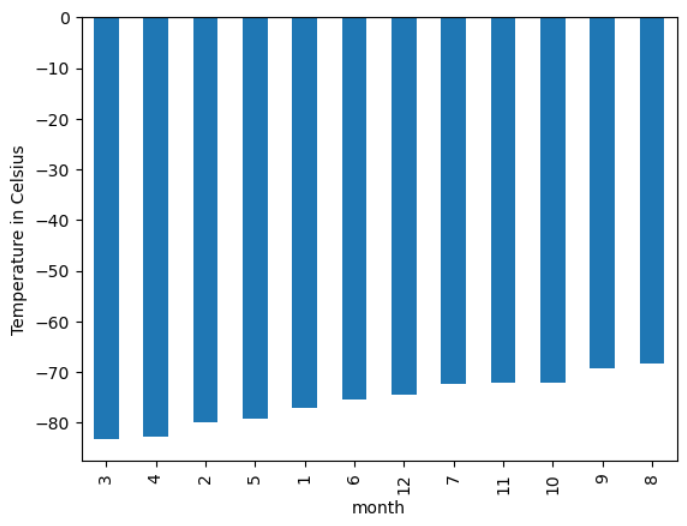
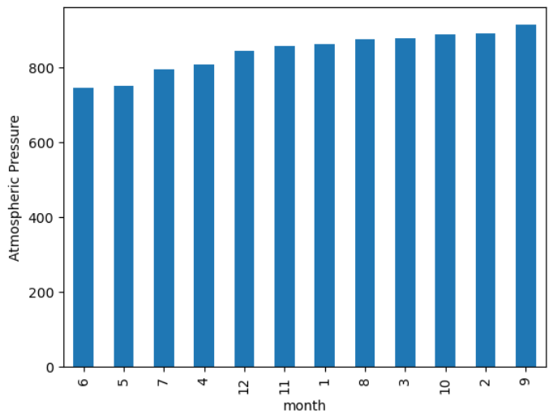
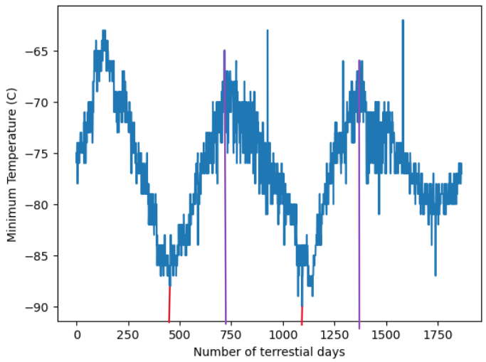
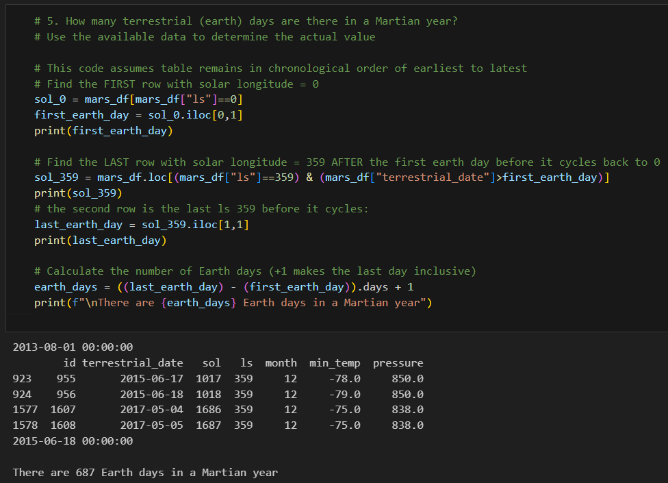

# Mars Webdata Analysis
This project scrapes data about Mars from two websites and analyzes the temperature data

# Features
* Using the Mars news site, https://static.bc-edx.com/data/web/mars_news/index.html, do the following:
  * Using Beautiful Soup, extract the titles and preview text of the news articles
  * Store this data in dictonary format and export it to afile
* Using the Mars temperature data site, https://static.bc-edx.com/data/web/mars_facts/temperature.html, fo the following:
  * Using Beautiful Soup, extract the table data and put it in a pandas dataframe
  * Convert the data into datetime, int, float formats to be able to perform analysis
  * Export the data to a csv file
  * Analyse the data as follows:
    * Determine how many months exist on Mars
    * Determine how many Martian (and not Earth) days worth of data exist in the scraped dataset
    * Use a bar chart to determine the coldest and warmest months
    * Use a bar chart to determine which months have the lowest and the highest atmospheric pressure
    * Using a plot of all the minimum termperature over time, estimate how many terrestrial (Earth) days exist in a Martian year
    * Determine the actual number of terrestrial (Earth) days in a Martian year

# Results

Minimum Temperature by Month | Atmospheric Pressure by Month
:-------------------------:|:-------------------------:
  |  

Minimum Temperature Over Time | Earth Day Calculation
:-------------------------:|:-------------------------:
The red lines or purple lines may be used to estimate how many Earth days are in a Mars year | The number of sol days couple with Earth date may be used to estimate how many Earth days are in a Mars year 
  |  

# File Notes
* Mars_Challenge folder contains the solution and export files for the Module 11 challenge
  * part_1_mars_news.ipynb contains the code to scrape titles and preview text from Mars News and store it in a file
  * part_2_mars_weather.ipynb contains the analysis of teh data scraped from Mars Weather Data
  * exports folder contains the files exported a part of the solutions 
    * mars_news_all_text_elements.json contains the optional export from Part 1 with json data for the text data of the news articles
    * mars_weather.csv contains the dataframe export of the table scraped in Part 2
* Starter_Code folder contains the files provided in BCS/Canvas for completing the challenge.
   

# References
No additional references beyond the Starter_Code
 
# Getting Started

## Prerequisites
You must have python, jupyter notebok, matplotlib, pandas, json, splinter, BeautifulSoup4 (bs4) to execute the notebook files.

## Cloning Repo
$ git clone https://github.com/vt-bekah/scrape-analysis-challenge.git 

$ cd scrape-analysis-challenge

# Built With
* Python v3.10.11
* jupyter notebook v6.5.2
* jupyterlab v3.6.3
* conda v23.5.0

**Python Modules**
* matplotlib v3.7.1
* pandas v1.5.3
* json v2.09
* splinter v.0.19.0
* bs4 v.0.0.1, BeautifulSoup4 v.4.12.2

